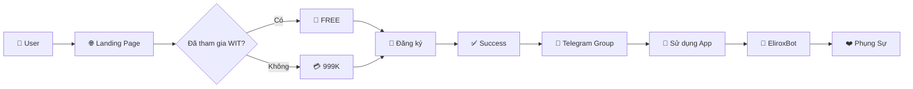

# 🏦 FREEDOM WALLET REGISTRATION SYSTEM

## 📖 Tổng Quan

Hệ thống đăng ký hoàn chỉnh cho **Freedom Wallet** - ứng dụng quản lý tài chính theo phương pháp 6 Hũ Tiền, một phần của hệ sinh thái tài chính toàn diện từ **WIT (Giàu Toàn Diện)**.

### 🎯 Mục Tiêu

Tạo một luồng đăng ký mượt mà từ **WIT** → **Freedom Wallet** → **EliroxBot** → **Phụng Sự**, giúp người dùng:
- 📊 Quản lý tài chính hiệu quả
- 💰 Xây dựng thói quen tài chính bền vững
- 📈 Đầu tư thông minh
- ❤️ Đóng góp cho cộng đồng

---

## 📁 Cấu Trúc Files

```
landingpage/
├── freedom-wallet-registration.html  # Landing page chính
├── FREEDOM_WALLET_FLOW.md           # Tài liệu flow chi tiết
├── DEPLOYMENT_GUIDE.md              # Hướng dẫn deploy từng bước
└── README_REGISTRATION.md           # File này

Freedom Wallet/
└── registration-handler.gs          # Google Apps Script backend
```

---

## 🎨 Landing Page Features

### 1. **Hero Section với Flow Diagram**
- Hiển thị đầy đủ 4 bước: WIT → Freedom Wallet → EliroxBot → Phụng Sự
- Animation và hover effects
- Responsive design

### 2. **Pricing Cards**
Hai gói đăng ký rõ ràng:

| Gói | Giá | Đối tượng | Ưu đãi |
|-----|-----|-----------|--------|
| **Học viên WIT** | **FREE** | Đã tham gia khóa học WIT | • Tư vấn 1-1<br>• Ưu tiên support<br>• Khóa học nâng cao |
| **Gói Cơ Bản** | **999K** | User mới | • Full features<br>• Telegram support<br>• Tài liệu đầy đủ |

### 3. **Form Đăng Ký**
Thu thập thông tin cần thiết:
- ✅ Họ và tên
- ✅ Số điện thoại (validation: 10-11 số)
- ✅ Email (validation: format)
- ✅ Username Telegram (@username)
- ✅ Trạng thái WIT (radio buttons)

### 4. **Features Section**
Giới thiệu 6 tính năng chính:
- 🏺 **6 Hũ Tiền**: Phân bổ ngân sách khoa học
- 📊 **Báo Cáo Chi Tiết**: Analytics và insights
- 💎 **Quản Lý Tài Sản**: Theo dõi investments
- 🎯 **Mục Tiêu Tài Chính**: Goal tracking
- 🔒 **Bảo Mật Cao**: Google Sheets encryption
- 📱 **Dễ Sử Dụng**: Mobile-first design

### 5. **Next Steps Section**
Hướng dẫn rõ ràng về các bước sau đăng ký

---

## ⚙️ Backend (Google Apps Script)

### Tính Năng

#### 1. **Data Management**
- ✅ Lưu trữ vào Google Sheet
- ✅ Auto-formatting (color coding theo gói)
- ✅ Timestamp tự động
- ✅ Data validation

#### 2. **Notifications**
- 📱 **Telegram bot**: Thông báo admin real-time
- 📧 **Email**: Confirmation cho user
  - Template khác nhau cho WIT/Regular user
  - HTML email với branding

#### 3. **Analytics**
- 📊 Function `getRegistrationStats()`
  - Total registrations
  - WIT vs Regular breakdown
  - Total revenue

#### 4. **Security**
- Input validation (server-side)
- Rate limiting (cache-based)
- CORS handling

---

## 🚀 Quick Start

### Option 1: Deploy Nhanh (5 phút)

1. **Clone/Download files**
   ```bash
   # Download files:
   - freedom-wallet-registration.html
   - registration-handler.gs
   ```

2. **Setup Google Sheet**
   - Tạo Google Sheet mới
   - Copy Spreadsheet ID

3. **Deploy Apps Script**
   - Open Apps Script from Sheet
   - Paste code từ `registration-handler.gs`
   - Update CONFIG
   - Deploy as Web App

4. **Update Landing Page**
   - Thay Web App URL vào HTML
   - Deploy lên hosting (GitHub Pages/Netlify)

5. **Done!** 🎉

### Option 2: Chi Tiết

Xem [DEPLOYMENT_GUIDE.md](DEPLOYMENT_GUIDE.md) cho hướng dẫn từng bước chi tiết.

---

## 🌊 User Flow



**Xem diagram chi tiết tại:** [FREEDOM_WALLET_FLOW.md](FREEDOM_WALLET_FLOW.md)

---

## 🔗 Links & Resources

### Telegram Groups
- 🎓 **WIT - Giàu Toàn Diện**: https://t.me/giautoandien
- 💰 **Freedom Wallet Support**: https://t.me/freedomwalletapp
- 🤖 **EliroxBot VIP**: https://t.me/eliroxvip

### Websites
- 🤖 **EliroxBot**: https://eliroxbot.com/
- 💼 **Freedom Wallet App**: [URL sẽ được cấp sau đăng ký]

---

## 📊 Data Structure (Google Sheet)

| Column | Type | Description |
|--------|------|-------------|
| Timestamp | DateTime | Auto-generated |
| Họ và Tên | String | Full name |
| Số Điện Thoại | String | 10-11 digits |
| Email | String | Valid email |
| Telegram Username | String | @username |
| Loại Gói | String | "Học viên WIT (FREE)" / "User thường (999K)" |
| Giá | Number | 0 / 999000 |
| Trạng thái Thanh toán | String | Status tracking |
| Source | String | "freedom-wallet-landing" |
| Ngày Đăng Ký | Date | dd/MM/yyyy |
| Link App Đã Gửi | String | Status flag |
| Ghi Chú | String | Admin notes |

---

## 🎨 Customization

### Thay Đổi Màu Sắc

Trong `freedom-wallet-registration.html`, phần CSS:

```css
:root {
    --primary-blue: #0066FF;      /* Màu chủ đạo */
    --primary-purple: #667eea;    /* Màu gradient 1 */
    --secondary-purple: #764ba2;  /* Màu gradient 2 */
    --gold: #FFD700;              /* Màu nhấn */
    --success-green: #00C853;     /* Màu thành công */
}
```

### Thay Đổi Giá

Tìm và sửa trong HTML:
```html
<div class="price">
    999K <small>VNĐ</small>
</div>
```

### Thay Đổi Telegram Links

Update các URLs:
```javascript
// Trong CONFIG object (Apps Script)
TELEGRAM_GROUP: 'https://t.me/freedomwalletapp',

// Trong HTML
href="https://t.me/freedomwalletapp"
```

---

## 🧪 Testing

### Test Cases

| # | Scenario | Expected Result |
|---|----------|-----------------|
| 1 | WIT member registration | • Gói FREE<br>• Email WIT template<br>• Green row in sheet |
| 2 | Regular user registration | • Gói 999K<br>• Payment email<br>• Yellow row in sheet |
| 3 | Invalid phone (9 digits) | • Validation error<br>• Form không submit |
| 4 | Invalid email format | • Validation error<br>• Form không submit |
| 5 | Telegram without @ | • Validation error<br>• Form không submit |

### Manual Testing Checklist

- [ ] Landing page load đúng
- [ ] Form validation hoạt động
- [ ] Submit form thành công
- [ ] Google Sheet nhận data
- [ ] Telegram notification gửi đúng
- [ ] Email confirmation gửi đúng
- [ ] Success modal hiển thị
- [ ] Redirect to Telegram group works
- [ ] Mobile responsive OK
- [ ] Cross-browser compatible

---

## 📈 Monitoring & Analytics

### Built-in Analytics

```javascript
// Gọi trong Apps Script
getRegistrationStats()
```

Returns:
```javascript
{
  total: 150,          // Tổng đăng ký
  witMembers: 80,      // Học viên WIT
  regularUsers: 70,    // User thường
  totalRevenue: 69930000  // VNĐ
}
```

### Telegram Stats Command

```javascript
// Send stats to Telegram
sendStatsToTelegram()
```

### Recommended External Tools

- **Google Analytics**: Track page views, conversions
- **Facebook Pixel**: Track ads performance
- **Hotjar**: Heatmaps và user behavior
- **Google Data Studio**: Advanced reporting

---

## 🔐 Security Features

### Implemented

✅ **Input Validation**
- Client-side (HTML5 + JS)
- Server-side (Apps Script)

✅ **Data Sanitization**
- Email format check
- Phone number format
- Telegram username validation

✅ **Rate Limiting**
- Prevent spam submissions
- Cache-based throttling

✅ **HTTPS Only**
- Secure data transmission

### Recommended Additions

- [ ] CAPTCHA (reCAPTCHA v3)
- [ ] IP logging
- [ ] Email verification
- [ ] Phone OTP verification
- [ ] Admin dashboard authentication

---

## 🐛 Troubleshooting

### Common Issues

#### 1. Form không submit được
**Giải pháp:**
- Check Console (F12) xem error
- Verify Apps Script URL đúng
- Check CORS settings

#### 2. Không nhận Telegram notification
**Giải pháp:**
- Verify Bot Token
- Check Chat ID
- Đảm bảo đã start bot

#### 3. Email không gửi được
**Giải pháp:**
- Check Gmail daily limit (100 emails/day)
- Verify email addresses
- Check Apps Script execution logs

Xem thêm: [DEPLOYMENT_GUIDE.md#troubleshooting](DEPLOYMENT_GUIDE.md#troubleshooting)

---

## 📞 Support

Nếu cần hỗ trợ:

1. **Documentation**
   - [FREEDOM_WALLET_FLOW.md](FREEDOM_WALLET_FLOW.md)
   - [DEPLOYMENT_GUIDE.md](DEPLOYMENT_GUIDE.md)

2. **Community**
   - 💬 Telegram: https://t.me/freedomwalletapp
   - 📧 Email: support@freedomwallet.com

3. **Issues**
   - Check logs: Apps Script > View > Executions
   - Test functions: `testRegistration()`

---

## 🛣️ Roadmap

### Phase 1: MVP ✅ (Complete)
- [x] Landing page design
- [x] Form với validation
- [x] Google Apps Script backend
- [x] Telegram notifications
- [x] Email confirmations
- [x] Deployment documentation

### Phase 2: Enhancements 🚧 (In Progress)
- [ ] Payment gateway integration (Momo, ZaloPay)
- [ ] Auto-send app links
- [ ] Admin dashboard
- [ ] A/B testing different versions

### Phase 3: Automation 📋 (Planned)
- [ ] Auto-add to Telegram groups
- [ ] Email marketing automation
- [ ] CRM integration
- [ ] Advanced analytics dashboard

### Phase 4: Scale 🚀 (Future)
- [ ] Mobile app
- [ ] AI chatbot support
- [ ] Multi-language support
- [ ] White-label solution

---

## 📜 License & Credits

### License
© 2026 Freedom Wallet by WIT - Giàu Toàn Diện

### Credits
- **Design**: Freedom Wallet Team
- **Development**: [Your Name/Team]
- **Concept**: WIT - Giàu Toàn Diện

### Technologies Used
- HTML5 / CSS3 / JavaScript
- Google Apps Script
- Google Sheets
- Telegram Bot API
- Gmail API

---

## 🎉 Getting Started

**Sẵn sàng bắt đầu?**

1. 📖 Đọc [DEPLOYMENT_GUIDE.md](DEPLOYMENT_GUIDE.md)
2. 🚀 Deploy theo hướng dẫn
3. 🧪 Test kỹ lưỡng
4. 📢 Quảng bá landing page
5. 💰 Thu hút users và tạo doanh thu!

**Chúc bạn thành công!** 🌟

---

## 📞 Contact

- 💬 **Telegram**: https://t.me/freedomwalletapp
- 📧 **Email**: support@freedomwallet.com
- 🌐 **Website**: [Coming soon]

---

**Made with ❤️ by Freedom Wallet Team**
